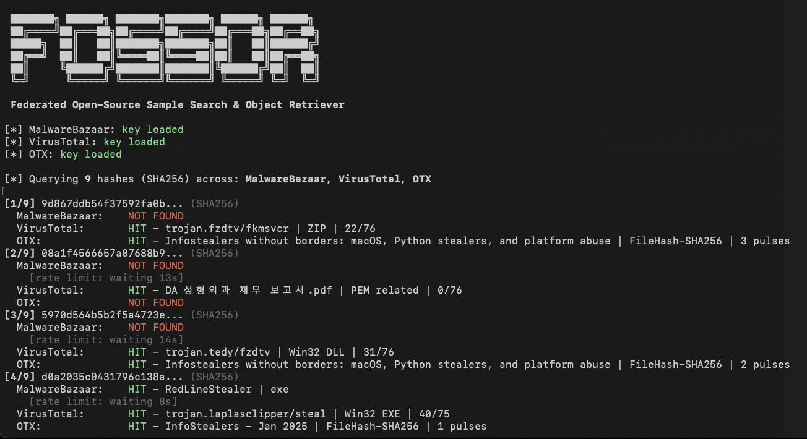

```
 ███████╗ ██████╗ ███████╗███████╗ ██████╗ ██████╗
 ██╔════╝██╔═══██╗██╔════╝██╔════╝██╔═══██╗██╔══██╗
 █████╗  ██║   ██║███████╗███████╗██║   ██║██████╔╝
 ██╔══╝  ██║   ██║╚════██║╚════██║██║   ██║██╔══██╗
 ██║     ╚██████╔╝███████║███████║╚██████╔╝██║  ██║
 ╚═╝      ╚═════╝ ╚══════╝╚══════╝ ╚═════╝ ╚═╝  ╚═╝
```

**Federated Open-Source Sample Search & Object Retriever**

A utility for looking up malware hashes across multiple threat intelligence sources. Simply run FOSSOR and provide it with a single hash or a text file (.txt or .csv) and instantly see which sources have intel on them -- with optional sample download.

<div align="center">
  

  <div align="left">
  <h4>
## Features

- **Multi-source lookup** -- queries MalwareBazaar, VirusTotal, and AlienVault OTX in a single run
- **Hash type auto-detection** -- supports MD5, SHA1, and SHA256 (detected by length)
- **Single hash or bulk file mode** -- pass a hash directly or point to a file of hashes
- **Sample download** -- download available malware samples from MalwareBazaar with `--download`
- **CSV export** -- export results with `--csv` for further analysis
- **Results matrix** -- at-a-glance grid showing which sources hit on which hashes
- **Color output** -- green/red/yellow terminal output (auto-disabled when piped)
- **Rate limiting** -- respects VirusTotal free tier limits (4 req/min)
- **Input sanitization** -- handles UTF-8 BOM, trailing whitespace, Excel CSV quirks
- **Extensible** -- add a new source by writing one function and one dict entry

## Requirements

- Python 3.10+
- `requests` library

```bash
pip install requests
```

## Setup

FOSSOR loads API keys from text files in the same directory as the script. Create one file per source containing only the key:

| Source | Key file | Where to get a key |
|---|---|---|
| MalwareBazaar | `mb-api.txt` | [abuse.ch Auth Portal](https://auth.abuse.ch/) |
| VirusTotal | `vt-api.txt` | [VirusTotal API](https://www.virustotal.com/gui/my-apikey) |
| AlienVault OTX | `otx-api.txt` | [OTX Account Settings](https://otx.alienvault.com/settings) |

Sources with missing key files are automatically skipped. You only need the sources you have access to.

```
fossor/
  fossor.py
  mb-api.txt      # your MalwareBazaar key
  vt-api.txt      # your VirusTotal key
  otx-api.txt     # your OTX key
  samples/        # created automatically by --download
```

## Usage

### Look up hashes from a file

```bash
python3 fossor.py hashes.txt
```

The input file should have one hash per line. Lines starting with `#` are treated as comments and ignored. Works with `.txt`, `.csv`, or any text file -- BOM and stray whitespace are handled automatically.

### Look up a single hash

```bash
python3 fossor.py d0a2035c0431796c138a26d1c9a75142b613c5417dc96a9200723870d0b3a687
```

### Export results to CSV

```bash
python3 fossor.py hashes.txt --csv results.csv
```

### Download available samples

```bash
python3 fossor.py hashes.txt --download
```

Downloads are saved to `./samples/` as password-protected zips. The password is always `infected`.

> **Warning:** Downloaded samples are live malware. Handle with appropriate caution -- use a VM or isolated analysis environment. Consider excluding the `samples/` directory from antivirus real-time scanning and Spotlight indexing.

### Disable specific sources

```bash
python3 fossor.py hashes.txt --no-vt          # skip VirusTotal
python3 fossor.py hashes.txt --no-mb --no-otx  # only query VirusTotal
```

### Combine options

```bash
python3 fossor.py hashes.txt --csv results.csv --download --no-vt
```

## Example Output

```
[*] MalwareBazaar: key loaded
[*] VirusTotal: key loaded
[*] OTX: key loaded

[*] Querying 9 hashes (SHA256) across: MalwareBazaar, VirusTotal, OTX

[1/9] 9d867ddb54f37592fa0b... (SHA256)
  MalwareBazaar:    NOT FOUND
  VirusTotal:       HIT - trojan.fzdtv/fkmsvcr | ZIP | 22/76
  OTX:              HIT - Infostealers without borders... | FileHash-SHA256 | 3 pulses
[2/9] d0a2035c0431796c138a... (SHA256)
  MalwareBazaar:    HIT - RedLineStealer | exe
  VirusTotal:       HIT - trojan.laplasclipper/steal | Win32 EXE | 40/75
  OTX:              HIT - InfoStealers - Jan 2025 | FileHash-SHA256 | 1 pulses

============================================================
Summary: 9 hashes queried across 3 sources

  MalwareBazaar:    1/9 found
  VirusTotal:       6/9 found
  OTX:              5/9 found

  Unique hashes with at least one hit: 7/9

Results Matrix:
  Hash               Malwar     VT    OTX
  ------------------ ------ ------ ------
  9d867ddb54f37592fa      -    HIT    HIT
  08a1f4566657a07688      -    HIT      -
  5970d564b5b2f5a472      -    HIT    HIT
  d0a2035c0431796c13    HIT    HIT    HIT
  59855f0ec42546ce2b      -      -      -
  a5b19195f61925ede7      -    HIT    HIT
  e7237b233fc6fda614      -    HIT      -
  59347a8b1841d33afd      -      -    HIT
  e965eb96df16eac926      -      -      -
============================================================
```

## Adding a New Source

FOSSOR is designed to be extended. To add a new threat intel source:

1. **Create the key file** (e.g., `newsource-api.txt`)

2. **Write a query function** following the existing pattern:

```python
def query_newsource(hash_val: str, api_key: str) -> Optional[dict]:
    # Query the API
    # Return None if not found
    # Return normalized dict if found:
    return {
        "hash": hash_val,
        "source": "NewSource",
        "status": "FOUND",
        "signature": "...",
        "file_type": "...",
        "file_name": "...",
        "first_seen": "...",
        "tags": "...",
        "detection_ratio": "...",
        "reporter": "",
    }
```

3. **Add an entry to the `SOURCES` dict:**

```python
"ns": {
    "name": "NewSource",
    "key_file": "newsource-api.txt",
    "rate_limit": 0,           # seconds between requests (0 = no limit)
    "query_fn": query_newsource,
    # "download_fn": download_newsource,  # optional
},
```


## Rate Limits

| Source | Limit | FOSSOR default |
|---|---|---|
| MalwareBazaar | None documented | No delay |
| VirusTotal (free) | 4 requests/min | 15s between requests |
| AlienVault OTX | 10,000 requests/hr | No delay |

## Downloads

At the current time, only samples available on MalwareBazaar are available for download. VirusTotal sample downloads require a premium API key and have not been included. OTX does not provide sample downloads (threat intelligence only).

## License

MIT
